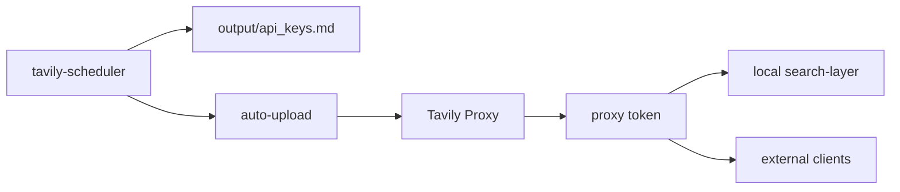

# oracle-proxy / Projects

## Project Navigation

| Project | Status | Access | Purpose | Priority | Doc |
|---|---|---|---|---|---|
| Tavily Proxy | running | `proxy.zhangxuemin.work:9874` | Tavily key pool, admin UI, unified search/extract API | Tier 1 | `./projects/tavily-proxy.md` |
| Tavily Key Generator | running | internal scheduler | 自动注册 Tavily 账号并产出 / 上传 key | Tier 1 | `./projects/tavily-key-generator.md` |
| Grok Register Stack | running | `:15072` adapter | 独立 Grok Turnstile solver stack | Tier 2 | `./projects/grok-register.md` |
| Grok2API | running | `:8000` | Grok API bridge/service | Tier 2 | `./projects/grok2api.md` |
| CLIProxy | running | `:8317` | OpenAI-compatible CLI proxy for local tools | Tier 2 | `./projects/cliproxy.md` |

## Relationship Snapshot

## Operational Notes
- Tavily chain is currently the most deeply documented and most actively maintained path on this host.
- Some machine-level services exist outside this project list (nginx, 1panel, sing-box, xray, cloudflared) and should be documented later as infrastructure services rather than app projects.
