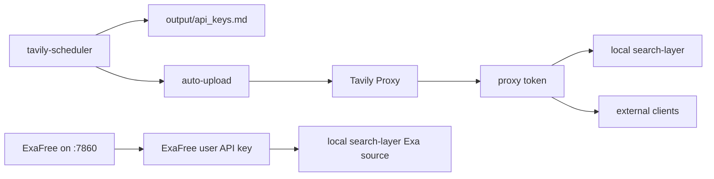

# oracle-proxy / Projects

## Project Navigation

| Project | Status | Access | Purpose | Priority | Doc |
|---|---|---|---|---|---|
| Tavily Proxy | running | `proxy.zhangxuemin.work:9874` | Tavily key pool, admin UI, unified search/extract API | Tier 1 | `./projects/tavily-proxy.md` |
| Tavily Key Generator | running | internal scheduler | 自动注册 Tavily 账号并产出 / 上传 key | Tier 1 | `./projects/tavily-key-generator.md` |
| ExaFree | running | `:7860` | Exa 账号注册 / 刷新 / 管理面板服务，并为本机 search-layer 提供 Exa 代理号池入口 | Tier 1 | `./projects/exafree.md` |
| Grok Register Stack | running | `:15072` adapter | 独立 Grok Turnstile solver stack | Tier 2 | `./projects/grok-register.md` |
| Grok2API | running | `:8000` | Grok API bridge/service | Tier 2 | `./projects/grok2api.md` |
| CLIProxy | running | `:8317` | OpenAI-compatible CLI proxy for local tools | Tier 2 | `./projects/cliproxy.md` |
| Network Stack | running | machine-level | nginx / sing-box / xray / cloudflared infrastructure | Infra | `./projects/network-stack.md` |
| OpenAi (migrated) | migrated-not-running | `/root/OpenAi` | 已从 OpenClaw 本机迁移过来的项目目录；当前仅存放文件，未纳入运行态 | Archive / Pending | `./projects/openai-migrated.md` |

## Relationship Snapshot

## Operational Notes
- **Important:** Tavily registration is currently **paused by design**. Do not treat stopped registration containers as accidental drift unless the pause decision is explicitly reversed.
- `proxy-tavily-proxy-1` remains active production surface; the paused part is the registration stack, not the proxy service.
- Tavily chain is currently the most deeply documented path on this host, but its registration half is in a paused / investigation state rather than normal production generation.
- ExaFree is both a standalone service and a downstream dependency of the local `search-layer` skill.
- Some machine-level services exist outside this project list (nginx, 1panel, sing-box, xray, cloudflared) and should be documented later as infrastructure services rather than app projects.
