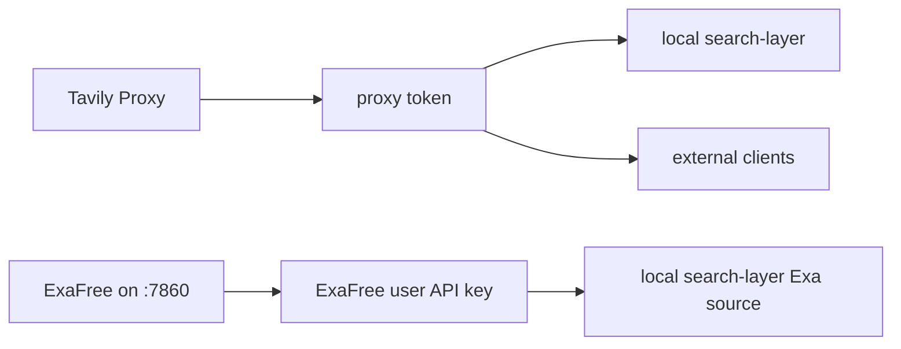

# oracle-proxy / Projects

## Project Navigation

| Project | Status | Access | Purpose | Priority | Doc |
|---|---|---|---|---|---|
| Tavily Proxy | running | `proxy.zhangxuemin.work:9874` | Tavily key pool, admin UI, unified search/extract API | Tier 1 | `./projects/tavily-proxy.md` |
| ExaFree | running | `:7860` | Exa 账号注册 / 刷新 / 管理面板服务，并为本机 search-layer 提供 Exa 代理号池入口 | Tier 1 | `./projects/exafree.md` |
| Grok Register Stack | retired-cleaned | removed; previous `:15072` adapter retired | Legacy Grok Turnstile solver stack; containers/images removed 2026-06-07 | Retired | `./projects/grok-register.md` |
| Grok2API | running | `:8000` | Grok API bridge/service | Tier 2 | `./projects/grok2api.md` |
| CLIProxy | running | `:8317` | OpenAI-compatible CLI proxy primary pool for local tools | Tier 2 | `./projects/cliproxy.md` |
| CLIProxy Backup Pool | running | `proxy-bak.zhangxuemin.work` / `proxy-bak-cn.zhangxuemin.work` / `:8318` | 独立备用 CLI Proxy API 池；同一静态家宽出口；每日镜像更新 | Tier 2 | `./projects/cliproxy-backup.md` |
| CPA Manager Plus | running | `cpam.zhangxuemin.work` / `cpam-cn.zhangxuemin.work` | Web 管理面板 + Manager Server for cliproxy / CPA usage analytics | Tier 2 | `./projects/cpa-manager-plus.md` |
| GPT Account Manager | running | `gptam.zhangxuemin.work` / `gptam-cn.zhangxuemin.work` | GPT 账号/邮箱/刷新工作台；Docker 部署，源站只绑定 loopback | Tier 2 | `./projects/gpt-account-manager.md` |
| Kiro-Go | running | `kiro.zhangxuemin.work` / `kiro-cn.zhangxuemin.work` | Convert Kiro accounts into OpenAI/Anthropic-compatible APIs with web admin panel | Tier 2 | `./projects/kiro-go.md` |
| Kiro-RS | running | `kiro-rs.zhangxuemin.work` / `kiro-rs-cn.zhangxuemin.work`; origin `127.0.0.1:18769` | Rust Anthropic-compatible Kiro API proxy with optional admin UI and credential management | Tier 2 | `./projects/kiro-rs.md` |
| Kiro Docs | running | `docs.zhangxuemin.work` / `docs-cn.zhangxuemin.work` | Public static VitePress documentation built from `Facetomyself/kiro` `使用说明.md` and images | Tier 3 | `./projects/kiro-docs.md` |
| Card Shop | running | `card.zhangxuemin.work` / `card-cn.zhangxuemin.work` | Kiro card-code generation, redeem, and redeemed-card history query with admin backend | Tier 2 | `./projects/card-shop.md` |
| GPT Card Shop | running | `gpt-card.zhangxuemin.work` / `gpt-card-cn.zhangxuemin.work`; origin `127.0.0.1:18768` | ChatGPT account card delivery with CPA zip / sub2api merged JSON / original JSON downloads | Tier 2 | `./projects/gpt-card-shop.md` |
| GPT Session Converter | running | `gpt-session.zhangxuemin.work` / `gpt-session-cn.zhangxuemin.work` | Static browser-only converter for ChatGPT session / Codex / 9router / AxonHub / Codex-Manager JSON formats | Tier 3 | `./projects/gpt-session-converter.md` |
| zcode2api | running | `zcode.zhangxuemin.work` / `zcode-cn.zhangxuemin.work`; origin `127.0.0.1:18770` | Anthropic-compatible Z.AI Coding Plan gateway/admin panel; Docker deployment, source bound only to loopback | Tier 2 | see zcode2api notes below |
| Network Stack | running | machine-level | nginx / sing-box / xray / cloudflared / caddy-cpam infrastructure | Infra | `./projects/network-stack.md` |
| Proxy Fallback Pool | available | `:30002/:30003/:30005/:30006/:14391` | 已外测通过的额外非 HK 代理节点包，可发布为 `Oracle-Proxy-Extra` | Tier 2 | `./projects/proxy-fallback-pool.md` |
| OpenAi (migrated) | migrated-not-running | `/root/OpenAi` | 已从 OpenClaw 本机迁移过来的项目目录；当前仅存放文件，未纳入运行态 | Archive / Pending | `./projects/openai-migrated.md` |

## Relationship Snapshot

```mermaid
flowchart LR
  D[Tavily Proxy] --> E[proxy token]
  E --> F[local search-layer]
  E --> G[external clients]

  H[ExaFree on :7860] --> I[ExaFree user API key]
  I --> J[local search-layer Exa source]
```

## Operational Notes
- `proxy-tavily-proxy-1` remains active production surface for the Tavily proxy service.
- The legacy Tavily registration scheduler/Camoufox stack is retired-cleaned: `tavily-scheduler`, `tavily-camoufox`, and `tavily-camoufox-adapter` containers/images were removed on 2026-06-07; the active Tavily Proxy was intentionally preserved.
- ExaFree is both a standalone service and a downstream dependency of the local `search-layer` skill.
- `Proxy Fallback Pool` is not a separate deployable app; it is an operator-facing documented pack of already verified host-level listeners that can be selectively published into private subscriptions.
- GPT Account Manager is intentionally exposed through the same `caddy-cpam` 443 front door pattern as CPA Manager Plus, while its Docker port is bound only to `127.0.0.1:18765`.
- Kiro-Go follows the same loopback-origin + Caddy HTTPS front-door pattern, with the app bound to `127.0.0.1:18766` and public/HK entrypoints on `kiro` / `kiro-cn`.
- Kiro-RS follows the same loopback-origin + Caddy HTTPS front-door pattern, with the app bound to `127.0.0.1:18769` and public/HK entrypoints on `kiro-rs` / `kiro-rs-cn`; credentials and API/admin keys live only on-host under `/root/containers/kiro-rs/config`.
- GPT Card Shop follows the same loopback-origin + Caddy HTTPS front-door pattern, with the app bound to `127.0.0.1:18768`; public/HK entrypoints are `gpt-card` / `gpt-card-cn`.
- GPT Session Converter is a static browser-only tool served from `/root/containers/gpt-session-converter/docs`; it is mounted read-only into `caddy-cpam` at `/srv/gpt-session-converter` and published through `gpt-session` / `gpt-session-cn`.
- zcode2api follows the same loopback-origin + Caddy HTTPS front-door pattern, with the app bound to `127.0.0.1:18770`; public/HK entrypoints are `zcode` / `zcode-cn`. The first ali-cloud placement was corrected on 2026-06-22 because HK should only be a traffic edge and the app source should stay on Oracle.
- Some machine-level services exist outside this project list (nginx, 1panel, sing-box, xray, cloudflared, caddy-cpam) and should be documented later as infrastructure services rather than app projects.

- Grok Register Stack is retired-cleaned: `grok-register-camoufox` and `grok-register-camoufox-adapter` containers/images were removed on 2026-06-07, and `:15072` should not be expected open.
